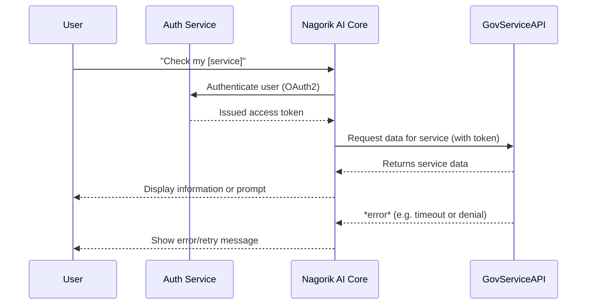
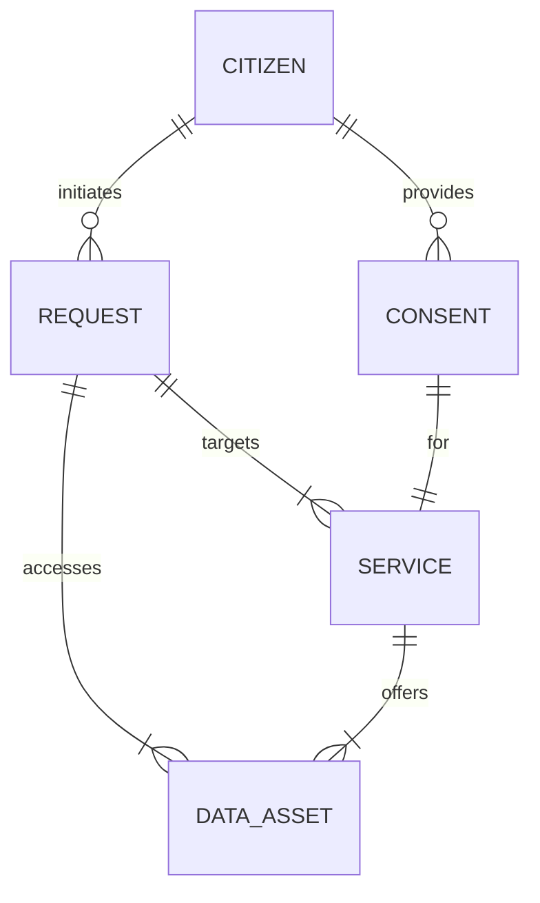
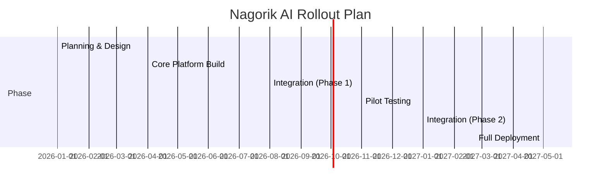

# Nagorik AI – National Citizen Services Integration Plan

**Executive Summary:** Nagorik AI is envisioned as a unified citizen-facing AI assistant that seamlessly integrates a country’s government services. We propose a generic yet extensible framework covering *all* public services categories (identity, health, education, finance, etc.) and provide guidance on localizing it. Our plan inventories key service domains, maps each to data/API sources and legal constraints, and outlines a secure, scalable integration architecture. We include a detailed implementation roadmap with milestones, required telemetry/metrics, and a robust security/privacy checklist. Emphasis is on using official APIs (or open data portals) and industry best practices: e.g. OAuth2 for auth, JSON/API standards, monitoring SLOs (response times, error rates) and legal compliance (GDPR-like consent and data retention policies). We recommend an agile, pilot-first rollout and provide sample API contract templates, monitoring queries, staffing scenarios, and accessibility/multilingual guidelines (e.g. WCAG, Executive Order 13166). 

The first implementation and validation environment is Bangladesh.

Bangladesh provides:
- Large population
- Diverse government services
- Multiple digital public infrastructure systems
- High potential social impact

Success in Bangladesh will validate a framework that can be adopted
by governments globally.

## 1. Government Services Inventory

We define a **comprehensive catalog of public services** organized by category.  For each, the AI assistant can answer queries and invoke backend APIs or databases.  Key categories include:

- **Identity & Demographics:** National ID (e.g. eID, social security), citizen registry (birth/death certificates, marriage), voter registration. *Data source:* national ID system (e.g. Bangladesh’s Porichoy ID API), civil registry portal. *Auth:* Digital ID login (OAuth2, biometric e-KYC). *Privacy:* Consent required (GDPR principles).
- **Financial & Tax:** Income tax e-filing, tax status, subsidies, social transfers (pensions, unemployment aid). *Data:* Tax authority APIs (e.g. online tax portal), central bank/subsidy databases. *Auth:* Login with credentials (2FA) or linked bank account. *SLA:* Typically 99% uptime, 24/7 access. *Legal:* Personal financial data requires explicit consent and is covered by privacy law.
- **Health & Social Care:** Vaccination records, medical insurance, welfare programs, benefits. *Data:* Health ministry databases, insurance provider APIs. *Auth:* Health ID or hospital login. *Privacy:* Protected under health privacy laws (similar to GDPR healthcare provisions).
- **Education & Credentials:** School/college transcripts, scholarship status, certification verification. *Data:* Education ministry systems, exam boards. *Auth:* Student/graduate portal login. *Consent:* Data often publicly available to holder, but PII masked.
- **Transportation & Licensing:** Driver’s license status, vehicle registration, traffic fines, public transit info. *Data:* Transport authority APIs (DMV), public transit schedules. *Auth:* Driver ID login. *Privacy:* Some location data may be shared.
- **Business & Licenses:** Business registration, permits, trade licenses, professional certifications. *Data:* Company registry API, permit office systems. *Auth:* Business ID or digital signature (e-sign). *Consent:* Corporate data often public; personal data follows business privacy rules.
- **Public Utilities:** Electricity, water, gas bills and payments. *Data:* Utility company portals/APIs. *Auth:* Utility account login (OAuth2). *SLA:* High availability needed for billing cycles. *Privacy:* Payment data sensitive.
- **Justice & Regulations:** Court case status, police clearance, land registry, judicial notices. *Data:* Court system APIs, land records databases. *Auth:* Lawyer or citizen login (with strong auth). *Legal:* Some data public (e.g. judgments), PII (suspect info) protected.
- **Culture & Recreation:** Passport services, tourism info, public event calendars. *Data:* Immigration API, culture department data. *Auth:* Passport office login. *SLA:* Real-time processing during high demand (holiday season).
- **Grievance & Feedback:** Citizen complaint systems, public feedback, RTI inquiries. *Data:* Grievance Redressal System (e.g. Bangladesh’s GRS), RTI portals. *Auth:* Citizen identity login. *Consent:* All info shared by user is opt-in.

The above categories draw on global and local frameworks.  For example, Bangladesh’s National Digital Architecture lists many of these services on its *e-Service Bus* (NID, civil registry, tax, e-Nothi, e-KYC, etc.).  Similarly, digital-government best practices emphasize integrating **identity, tax, licensing, healthcare, and education** systems into unified citizen portals. In an unspecified country context, replace placeholders with local equivalents (e.g. use the country’s official open data portal or API catalog). 

## 2. Service-to-Data Mapping

For each service category, we map to official data sources or APIs, and note access requirements and constraints:

| **Service Category**    | **Example Services**                          | **Data/API Source**                                      | **Auth/Consent**                               | **SLA & Privacy**                                                            |
|-------------------------|-----------------------------------------------|----------------------------------------------------------|------------------------------------------------|------------------------------------------------------------------------------|
| **Digital Identity**    | National ID verification, e-KYC               | National ID API (e.g. Porichoy.gov.bd), NID database | OAuth2 with Government eID; user consent       | 24/7 availability; user consent mandatory (GDPR consent principles). |
| **Civil Registration**  | Birth/death certificates, marriage registry   | Civil registry portal API                                 | Same as digital ID (linked to ID); user permission | Strong encryption; only holders can request; retention per law.             |
| **Tax & Finance**       | Income tax filing, e-tax returns              | Tax authority API (e.g. NBR); central budget DB          | Government login (2FA), e-signature for filings | 99.x% uptime SLAs (tax deadlines); financial data requires strict consent.   |
| **Social Welfare**      | Pensions, unemployment aid, food rations      | Social services DB (Ministry of Welfare)                 | Government login (ID); opt-in or opt-out        | Sensitive personal data; purpose limitation applies.        |
| **Health Records**      | Vaccination status, medical claims            | National health ID/insurance API                         | Health-ID auth; HIPAA/GDPR-level consent        | High privacy (health data); use tokenization (PETs) for PII. |
| **Education**           | Student transcripts, scholarships             | Education ministry API, exam board DB                    | School/university login; user consent           | Parental consent for minors; record accuracy required.                      |
| **Licenses & Permits**  | Driving license, business permits             | DMV and licensing API (Gov portal)                       | Licensee login (often e-sign)                    | Government may publish aggregate stats (open data); personal data protected. |
| **Land & Property**     | Land deeds, property tax                      | Land registry API, Survey dept database                  | Owner auth (ID)                                 | Title records often public; owner data privacy (address) controlled.        |
| **Justice**             | Court case status, police records             | Judiciary/court API, police clearance system             | Citizen auth (ID); lawyer auth                  | Many records public; suspects/victims data protected; audit logs required.  |
| **Public Utilities**    | Bill payments (electricity, water)            | Utility provider APIs (e.g. power, water)                | Utility account login; use OAuth for each utility | Must track usage; customer data kept confidential under privacy law.        |
| **Transportation**      | Vehicle registration, traffic fines           | Transport authority API (DMV), police DB                 | Driver’s ID login; maybe toll tag linkage        | Safety-critical SLA; user location data privacy (opt-in GPS use).           |
| **Business Registry**   | Company registration, tax certificates        | Corporate registry API (Registrar of Firms)              | Business owner auth; corporate digital signature | Financial disclosures public; personal guarantor data protected.           |
| **Tourism & Culture**   | Visa/passport status, museum permits          | Immigration/passport API, culture ministry DB            | Biometric auth (e-Passport)                      | International data-sharing laws; visa data confidential.                     |
| **Grievance & RTI**     | Citizen complaint tracking, information requests | Grievance Redressal API, RTI portal                      | Citizen auth via ID; consent to publish issues   | Transparency laws often require public disclosure of outcomes.              |

*Sources:* We leverage official portals and standards. For example, Bangladesh’s e-Service Bus lists many of the above (NID system, e-KYC, e-Nothi for official documents, etc.). API design should follow government guidelines (e.g. UK’s API standards: JSON, UTF-8, consistent naming, OAuth2, standard HTTP codes). Authentication/consent must follow privacy laws: **GDPR**-style consent (“freely given, specific, informed and unambiguous”) and **data minimization**. All personally identifying data (PII) should be tokenized or encrypted, and only stored as long as legally necessary.

## 3. Integration Architecture

Our architecture follows **API-led, service-oriented integration** with modern patterns: API Gateway, microservices/orchestration, and cloud infrastructure.  Key components:

- **Frontend (Nagorik AI Chatbot):** Conversational UI (web/mobile) that understands user intents and maps to services. It calls backend orchestration APIs.  
- **Authentication Service:** Central ID broker (e.g. OAuth2 Identity Server) that handles government eID login (possibly leveraging national ID systems).  All API calls carry tokens.
- **Service Orchestration Layer:** A backend hub (the “Nagorik Core”) that routes requests to specific government service APIs. This layer handles caching, rate-limiting (per API and overall), retries, and error handling. It implements business logic to combine data from multiple services when needed (e.g. combining tax and benefit info).
- **Government Service APIs:** Official portals/APIs of each department (as inventoried above). These may be hosted on cloud or legacy servers. The Nagorik Core calls them via REST/JSON or SOAP, respecting each API’s specs and SLAs.
- **Data Layer/Cache:** A caching tier (e.g. Redis) for frequently accessed non-sensitive data (e.g. public info, static lists) to reduce API calls. A secure database for storing user preferences, consents, audit logs, and non-sensitive aggregated usage data. No raw PII is stored beyond tokens unless absolutely needed.
- **Monitoring & Analytics:** Integrated logging of requests, performance metrics, and failures. A monitoring stack (e.g. Prometheus/Grafana) tracks SLIs and triggers alerts. (See Section 5 for details.)
- **Security Gateway:** A WAF/API firewall to scan for malicious traffic. All inter-service calls are over HTTPS with token-based auth. Infrastructure uses cloud firewalls and a zero-trust model.

Below is a simplified **sequence diagram** for a user query flow:



This shows the typical flow: the user is authenticated once (via a secure OAuth2 flow) before any service API call.  The Nagorik Core then invokes the needed government API. If an API returns an error or is unavailable, the core handles it (logs the failure, possibly falls back, and notifies the user gracefully). 

Below is an **ER diagram** for core entities to illustrate data relationships:



- **CITIZEN**: Represents a user (with ID, name, demographics).
- **SERVICE**: A government service (e.g. “Income Tax Filing”).
- **REQUEST**: A service invocation (timestamp, input).
- **CONSENT**: A record that a citizen gave permission to use personal data for a service.
- **DATA_ASSET**: Data elements (e.g. “Tax Record”, “Vaccination History”) accessed by services.

Architectural best practices are guided by projects like **GovStack** (open technical blueprint for sovereign government platforms) and integration patterns.  We adopt API-led integration, event-driven handling for real-time alerts (e.g. on payment due), and a cloud-native stack (open source/commodity tech, per digital service playbooks).  A national e-Service Bus (as in the BNDA) is emulated via our orchestration layer to achieve interoperability.  Caching is used for high-traffic public data, while sensitive data flows through secure channels without caching. Rate limiting per API protects legacy systems. Error handling includes circuit-breakers for unstable endpoints.

## 4. Implementation Roadmap

We recommend an **agile, phased rollout**. Initial phases focus on building the core platform and integrating the highest-impact services. Later phases add breadth and scale. The table below outlines key milestones, estimated effort, dependencies, and risk mitigations:

| **Phase / Milestone**               | **Tasks**                                                     | **Effort** | **Dependencies**              | **Risks & Mitigations**                         |
|-------------------------------------|---------------------------------------------------------------|------------|-------------------------------|-------------------------------------------------|
| **1. Planning & Service Inventory** | Document all target services; gather API docs; stakeholder workshops. | Low        | Inter-dept coordination       | *Risk:* Incomplete catalog. *Mitigation:* Use open data portals and existing frameworks (e.g. BNDA) to bootstrap. |
| **2. Core Platform Setup**          | Develop auth layer (OAuth2 IdP), API gateway, core services. | Medium     | Identity provider, cloud infra | *Risk:* Auth complexity. *Mitigation:* Use proven open-source IdP (e.g. WSO2, Keycloak) and follow best practices. |
| **3. Integrate High-Value Services**| Connect e.g. ID verification, tax lookup, land info.         | High       | Core platform, service APIs   | *Risk:* API changes/unavailability. *Mitigation:* Build adapters; use cached data where possible. |
| **4. Pilot Deployment**             | Launch MVP with select services to beta users; gather feedback. | Medium     | Integrated services (3)       | *Risk:* Low adoption. *Mitigation:* User research (USDS Playbook: test with real users); refine UX. |
| **5. Scaling and Full Rollout**     | Add remaining services; optimize performance; national launch.  | High       | Pilot results, dev team       | *Risk:* Overload/complexity. *Mitigation:* Incremental enablement by region/service; use cloud auto-scaling (per playbook). |

*Example Gantt (quarters):*



Effort is tagged “Low/Med/High” based on scope (staff-months).  We follow the **digital services playbook**: develop an MVP quickly (<3 months) and iterate.  Each integration sprint should include automated tests and security reviews.  Dependencies (like finalized APIs or legal approvals) are tracked early. Key risks are managed by phased pilots (e.g. initial region or department) and fallback plans (e.g. cached data when live API fails). 

## 5. Telemetry & Metrics

We will track SLIs/SLOs aligned with performance, cost, accuracy, and satisfaction:

- **Performance:** API response time (p50/p95/p99) and error rate for each service. *Targets:* e.g. 95% of requests <500ms, error rate <0.1%. Following USDS guidance, we monitor median, 95th and 98th percentiles. Use APM tools (e.g. Azure Monitor, Datadog). 
- **Cost:** Cloud resource usage and billing. *Metrics:* CPU/memory usage, number of requests per second. Set budget alerts for monthly spend. 
- **Accuracy:** For AI responses or data lookups, track accuracy or freshness. *Metrics:* Success rate of correct answers (via user feedback surveys), data staleness. 
- **User Satisfaction:** Net Promoter Score or satisfaction surveys after service use. *Alert Threshold:* e.g. <80% satisfaction triggers review. 

For example, we might use Kusto queries (KQL) to monitor API performance.  **Example KQL:** 
```
requests
| where cloud_RoleName == "NagorikAI"
| where name startswith "GET /service/"
| summarize P95_duration = percentile(duration, 95), error_rate = sum(success==0)/count() by bin(timestamp, 1h)
```
This computes hourly 95th-percentile latency and error rate for each service endpoint.  For SQL-based logs, an example query:
```sql
SELECT service_name,
       COUNT(*) AS calls,
       AVG(response_time) AS avg_ms,
       SUM(CASE WHEN status_code>=500 THEN 1 ELSE 0 END) AS errors
FROM api_logs
WHERE timestamp > DATEADD(DAY, -1, GETDATE())
GROUP BY service_name;
```
These help populate dashboards.  Automated alerts (e.g. PagerDuty) are set if SLOs breach.  The USDS playbook recommends publishing key metrics internally and using alerts before SLO violations. 

## 6. Security, Compliance & Data Governance

**Checklist:** Ensure PII protection, legal compliance, and accountability. Key items:

- **Data Protection:** Follow GDPR-like principles. Collect only minimal data (“data minimization”) and for stated purposes. Store personal data with strong encryption or tokenization. Define retention: e.g. delete logs after required period.
- **Consent & Privacy Notices:** Explicitly obtain consent for sensitive data use, following “freely given, specific” consent rules. Provide clear privacy policy and right to withdraw consent. Log all consent events.
- **Authentication & Access Control:** Use OAuth2 tokens and role-based access (zero-trust). Avoid “anonymous” access except for truly public info. Multi-factor auth for admin roles.
- **Audit & Logging:** Keep detailed audit trails for all data access/changes (who accessed what, when). This supports accountability and legal audits (e.g. as required by data protection laws). Retain logs per policy.
- **Legal Reviews:** Engage legal/privacy officers early (e.g. conduct a Privacy Impact Assessment or SORN). Ensure compliance with national data laws (e.g. Digital Security Acts) and international norms (GDPR, etc.).
- **Security by Design:** Regular vulnerability scanning and pen-testing of components. “Pre-certify” common infrastructure (e.g. FedRAMP or equivalent for cloud). Use WAFs and enforce TLS encryption end-to-end.
- **Governance:** Establish a data governance board to oversee data sharing, usage, and breaches. Define incident response processes. Log all data sharing between agencies.

These align with best practices in the digital services literature.  For example, teams should engage privacy officers at design time to define data usage, retention, and user rights.  All data handling must be transparent and auditable. 

## 7. Testing & Rollout Strategy

**Testing Plan:**  
- **Unit & Integration Tests:** Developers write automated tests for each module (API adapters, NLP intent parsing, etc.) and integrate into CI pipelines. This ensures regressions are caught early.
- **Load & Performance Tests:** Simulate high-traffic scenarios (e.g. tax season surge) using tools like JMeter or cloud testing. Per the playbook, run load tests before any public launch, ensuring the system degrades gracefully.
- **Security/Privacy Tests:** Conduct regular security assessments (code scans, penetration tests) and privacy audits. Check compliance with privacy policies (possible independent PIAs).
- **User Acceptance Testing (UAT):** Pilot with real users (e.g. focus groups in one city or service domain). Gather feedback on accuracy, usability, language, etc. Iterate rapidly.
- **Accessibility Testing:** Verify compliance with WCAG 2.1 (e.g., using automated checkers and manual audits with assistive tech). Ensure multilingual content is correct (human translation review).
- **Monitoring Tests:** Test alerting paths by simulating failures (e.g. API endpoint down) and verify on-call response.

**Rollout:** We recommend **pilot → phased → full** rollout. Begin with a limited pilot (e.g. one service category or region) to validate assumptions. For instance, first support English and one major local language, then add languages (per Section 508 and EO13166 guidance). After pilot fixes, expand services and geographies in phases. Continuous deployment (CD) allows frequent updates. The Digital Services Playbook advises releasing an MVP quickly (≤3 months) and iterating with user feedback; we adopt that approach.

## 8. API Contracts & Monitoring Queries

**Sample API Contract (OpenAPI style excerpt):**  
```yaml
paths:
  /citizen/{nid}/tax/filing:
    get:
      summary: Retrieve tax filing status
      parameters:
        - name: nid
          in: path
          required: true
          schema:
            type: string
      security:
        - oauth2: [ "tax.read" ]
      responses:
        '200':
          description: Successful response
          content:
            application/json:
              schema:
                $ref: '#/components/schemas/TaxStatus'
        '401': { description: Unauthorized }
        '500': { description: Server error }
```
This defines a secured endpoint (OAuth2), JSON response, and standard HTTP codes. Contracts should be versioned and documented (Swagger/OpenAPI). Error messages must avoid leaking internal info.

**Monitoring Queries:**  (For illustration)

- **Kusto (Azure Monitor):**  
  ```kql
  requests
  | where name == "GET /service/taxStatus"
  | summarize avgDuration=avg(duration), P95=percentile(duration,95), errorCount=sum(success==false)
      by bin(timestamp, 1h)
  ```

- **SQL (for a logging DB):**  
  ```sql
  SELECT TOP 5 endpoint, AVG(response_time) as avg_ms, SUM(error_flag) as errors
  FROM api_request_logs
  WHERE timestamp > DATEADD(hour, -24, GETDATE())
  GROUP BY endpoint
  ORDER BY avg_ms DESC;
  ```

Such queries help populate our dashboards (e.g. Grafana) to ensure SLOs are met.

## 9. Staffing & Budget

**Team Roles:** A successful Nagorik AI project needs a cross-functional team. Key roles include:
- **Product Manager:** Oversees requirements, stakeholder coordination, and roadmap.
- **Solution Architect/Tech Lead:** Designs the integration architecture (cloud, APIs).
- **Backend Engineers:** Implement API integrations, microservices, and DevOps pipelines.
- **AI/NLP Specialist:** Develops the conversation engine and machine learning models.
- **Frontend/UX Engineers:** Build the chat interface and web/mobile apps, ensuring accessibility.
- **Data Engineer:** Manages data pipelines, caching, and monitoring/analytics infrastructure.
- **Security & Compliance Officer:** Ensures privacy/security requirements are met (as per GDPR, etc.).
- **QA/Test Engineers:** Automate tests and conduct load/perf/security testing.
- **Support and Ops:** Run-day operations, handle incidents.
- **Localization Specialist:** Manages translations and cultural localization (for multilingual support).

Per best practice, team members should have experience in modern digital services. Contractors or consultants may be engaged (e.g. for UX or AI expertise) but include federal (gov) contracting and privacy experts on the team. 

**Estimated Budgets:** (illustrative, in unspecified currency)
- **Low Scenario:** A pilot/trial program with ~5–10 staff for 6–12 months: ~\$0.5–1M. Minimal service integration, use mostly open-source tools.
- **Medium Scenario:** Phase 1 rollout with ~15 staff over 1–2 years: \$1–5M. Integrate core services (ID, tax, healthcare) and scale infrastructure.
- **High Scenario:** Full national rollout with ~25+ staff over 2–3 years: \$5M+. Includes multi-language support, extensive AI capabilities, and all major services. 

These ranges depend on country size and scope. Budget includes personnel, cloud hosting costs, and any third-party services (e.g. ML tools). 

## 10. Accessibility & Multilingual Support

Nagorik AI must be **inclusive**. We recommend:

- **Accessibility:** Adhere to WCAG 2.1 (AA) and local laws (e.g. Section 508 in the US). This includes screen-reader compatibility, keyboard navigation, clear language, and high-contrast UI. Incorporate accessibility into design and testing from the start. (Per playbook: “Accessibility isn’t just the right thing to do; it’s the law”.)

- **Plain Language:** Use simple, jargon-free language in all user-facing texts. Where possible, present information at 6th–8th grade reading level.

- **Multilingual Content:** Provide interfaces and responses in the local official languages (e.g. Bengali and English for Bangladesh, English/Spanish for US). Follow guidelines such as Executive Order 13166 (US) and Title VI: ensure content is available for users with limited English proficiency. Offer a language selector and translate AI responses accurately (may require professional translation post-editing). 

- **Assistive Tech:** Support voice input/output for visually impaired users if feasible (speech-to-text, text-to-speech).

By prioritizing accessibility and multiple languages, Nagorik AI serves all citizens equitably. 

## Next Steps

1. **Establish a Steering Team:** Form a multi-agency working group (tech, legal, service owners) to sponsor Nagorik AI and remove roadblocks.  
2. **Complete Service Inventory:** Finalize the full catalog of services (aligning with BNDA-style list) and identify available APIs or data sources.  
3. **Prototype Core Platform:** Set up the OAuth2 identity service and a minimal API gateway. Use open-source components (e.g. WSO2, Kong).  
4. **Integrate Pilot Services:** Implement a small set of high-priority services (e.g. ID verification, one financial or welfare lookup). Test end-to-end.  
5. **Implement Monitoring:** Deploy APM/logging and define SLIs from day one (p95 response time, error rate). Configure alerts.  
6. **Conduct Privacy/Security Review:** Perform a Privacy Impact Assessment and security audit on the initial system; document data flows and consents.  
7. **User Testing & Feedback:** Pilot with a small user group. Collect feedback on usability and accuracy. Iterate on dialogue flows and coverage.  
8. **Plan Rollout:** Based on pilot results, schedule phased expansion (add services, languages, regions) per the roadmap above. Ensure funding and staffing align with each phase.  
9. **Governance and Updates:** Set up a process to regularly add new services, update APIs, and handle changes in law/policy. Keep the system open to improvement and transparent to the public.

By following this plan—grounded in government standards and user-centered design—Nagorik AI can evolve into a reliable, secure, and inclusive platform that brings all government services within citizens’ reach. 

